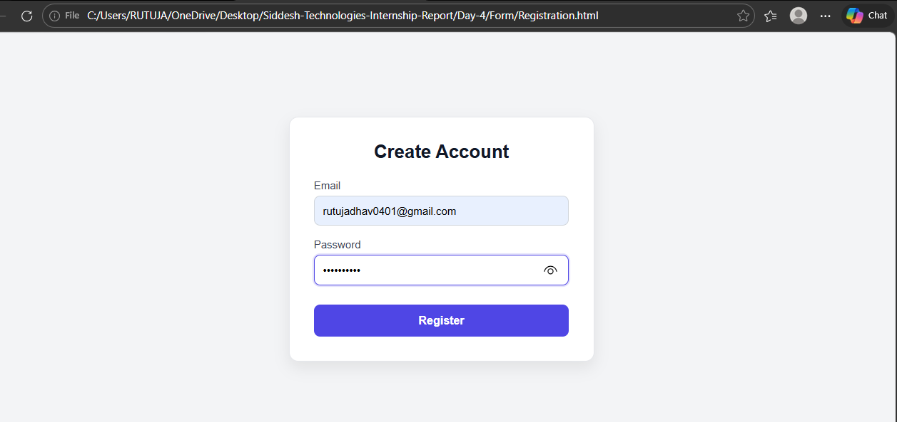
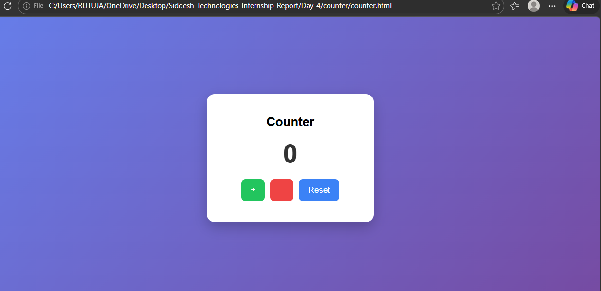
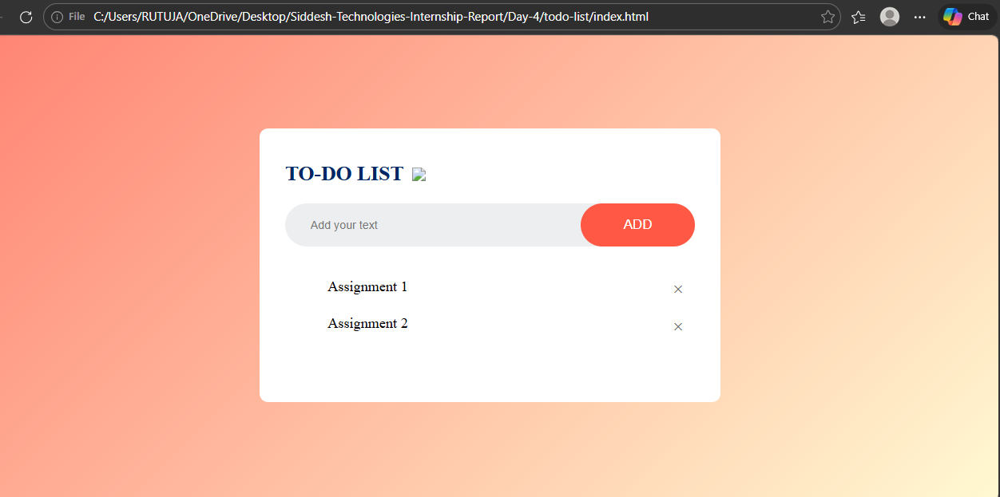

# Day-4 – Frontend Practice

On Day-4, I built three mini projects using HTML, CSS, and JavaScript to improve my frontend basics.

---

## 1. Registration Form
- Email and password validation using Regex  
- Displays error messages for invalid input  

### Screenshot

---

## 2. Counter App
- Increment, Decrement, Reset buttons  
- Updates count dynamically without refresh  

### Screenshot

---

## 3. To-Do List App
- Add tasks dynamically  
- Displays tasks instantly  

### Screenshot

---

## Technologies Used
HTML, CSS, JavaScript, Git, GitHub

---
