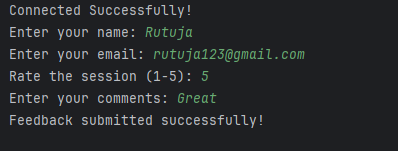
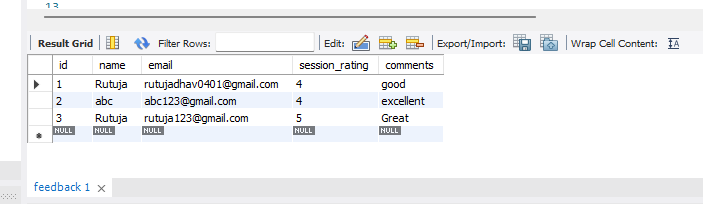

---

## 📸 Screenshots


### 💬 Feedback Submission (Console Output)



---

### 🗄 Database Table (MySQL)



# Feedback Management System

A simple Java-based Feedback Management System that connects to MySQL using JDBC.

## 📌 Features
- Connects to MySQL database
- Allows users to submit feedback
- Stores:
    - Name
    - Email
    - Session Rating
    - Comments
- Uses PreparedStatement for secure database insertion

---

## 🛠 Technologies Used
- Java (JDK 21)
- JDBC
- MySQL
- Maven
- IntelliJ IDEA

---

## 🗄 Database Setup

Run the following SQL commands:

```sql
CREATE DATABASE feedback_system;
USE feedback_system;

CREATE TABLE feedback (
    id INT PRIMARY KEY AUTO_INCREMENT,
    name VARCHAR(100),
    email VARCHAR(100),
    session_rating INT,
    comments TEXT
);
