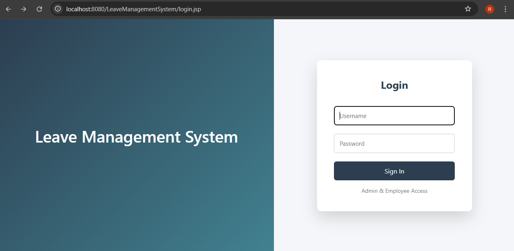
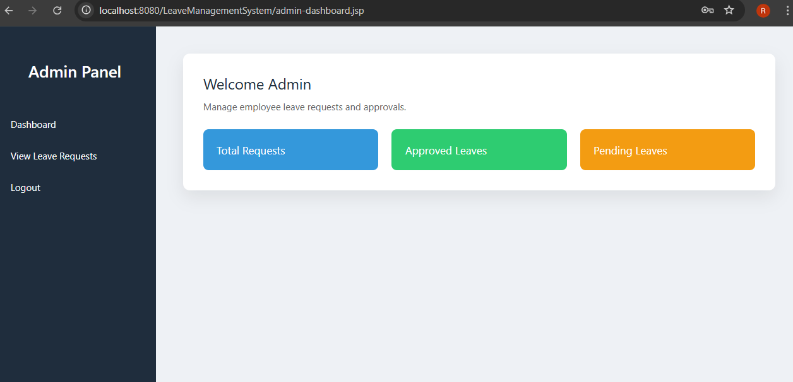
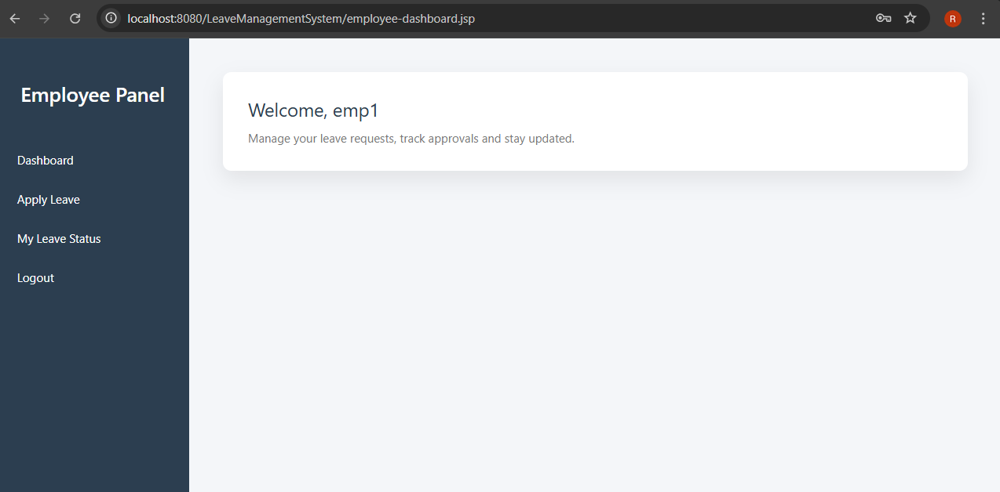

# Leave Management System

A web-based Leave Management System built using Java Servlets, JSP, JDBC, and MySQL.

## 🚀 Features
- User Login 
- Apply for Leave
- View Leave Status
- Session Management
- MySQL Database Integration

## 🛠 Technologies Used
- Java (Servlets & JSP)
- Apache Tomcat 10
- MySQL
- Maven
- JDBC

## 📂 Project Structure
- `LoginServlet` – Handles authentication
- `ApplyLeaveServlet` – Handles leave application
- `MyLeavesServlet` – Displays leave history
- JSP Pages – UI Layer
- DBConnection – Database connectivity

## 🗄 Database
Tables Used:
- users
- leaves

## ▶️ How to Run
1. Build project using Maven:
2. Copy WAR file from `target` folder.
3. Paste into Tomcat `webapps`.
4. Start Tomcat.
5. Open: http://localhost:8080/LeaveManagementSystem/login.jsp

## 📸 Screenshots

### 🔐 Login Page

### 📝 Admin Dashboard 

### 🏠 Employee Dashboard

