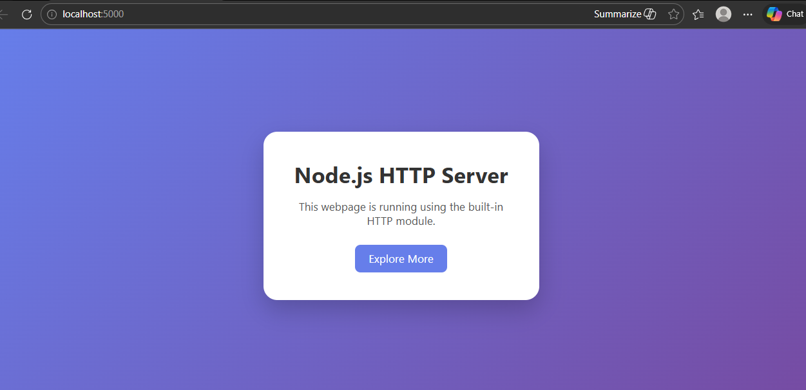

# Day 9

## 💻 Technologies Used
- Node.js  
- JavaScript  
- Git & GitHub  
- VS Code  

---

## 📚 Key Learnings
- Understood how server-side logic works in Node.js  
- Learned how to structure backend files properly  
- Improved debugging skills  
- Gained better clarity on project setup and execution  

---

## 🚀 How to Run

1. Install Node.js  
2. Open terminal inside this folder  
3. Run:
   ```bash
   npm install
   node server.js

---

## 📸 Screenshots

