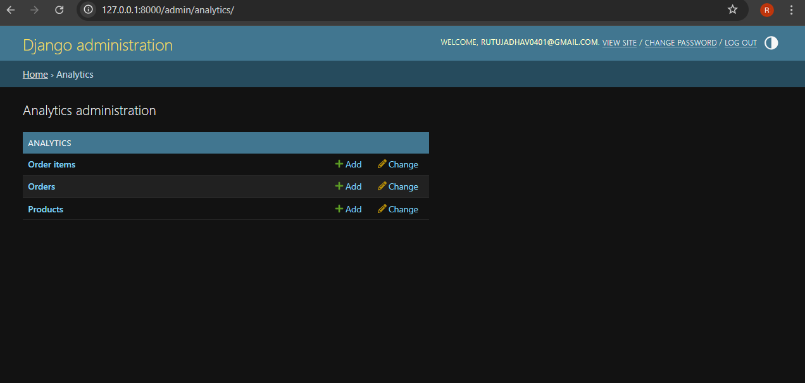
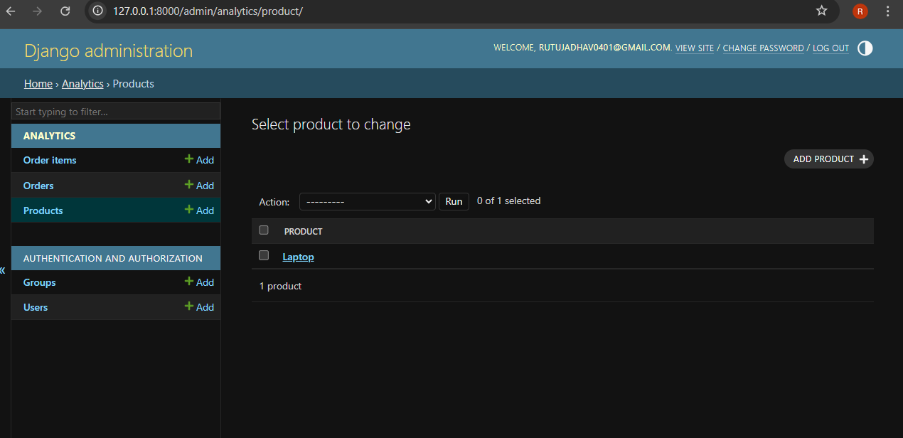
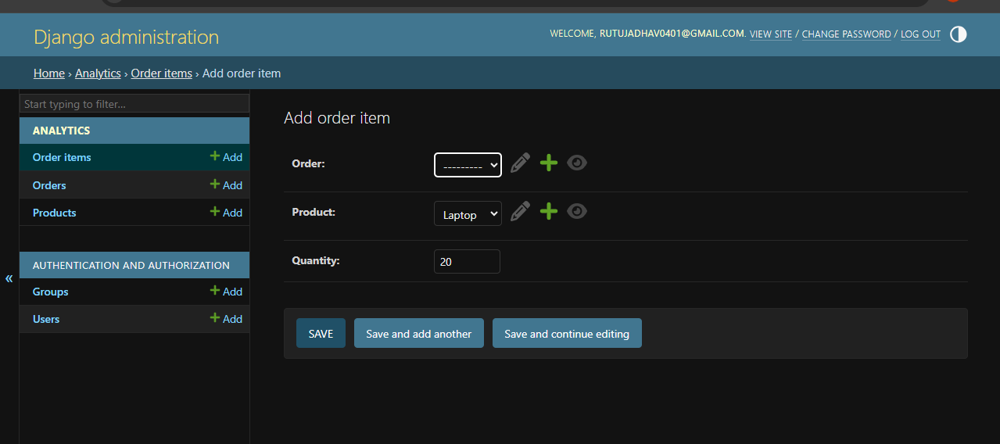
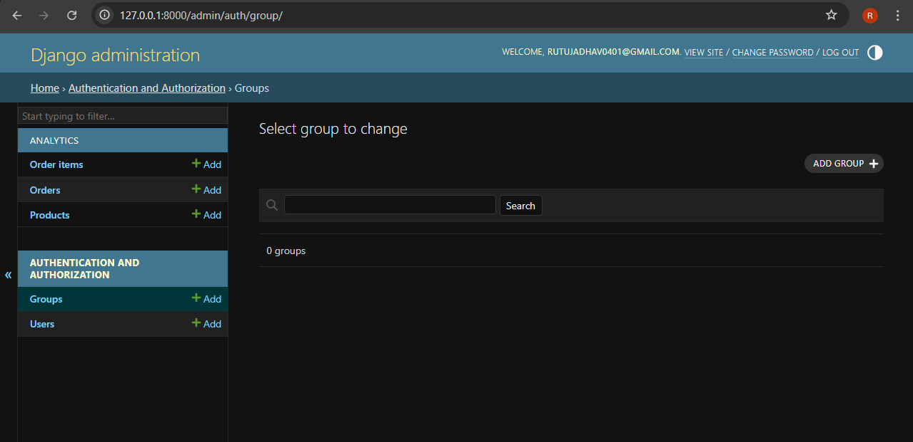
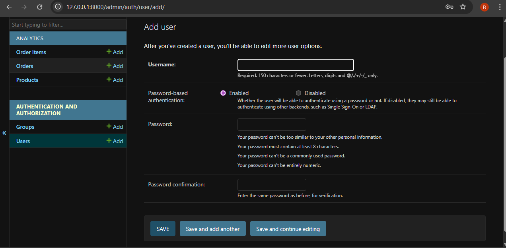

# 📊 E-Commerce Analytics Dashboard

A backend analytics system built using Django and Django REST Framework.  
It analyzes e-commerce order data and provides business insights via REST API.

---

## 🚀 Tech Stack
- Django
- Django REST Framework
- NumPy
- SQLite
- JSON API

---

## 📈 Features
- Product & Order Management
- Total Revenue Calculation
- Average Order Value
- Products Sold Tracking
- Analytics API Endpoint

---

## 🖥️ Screenshot

---

---

---

---
